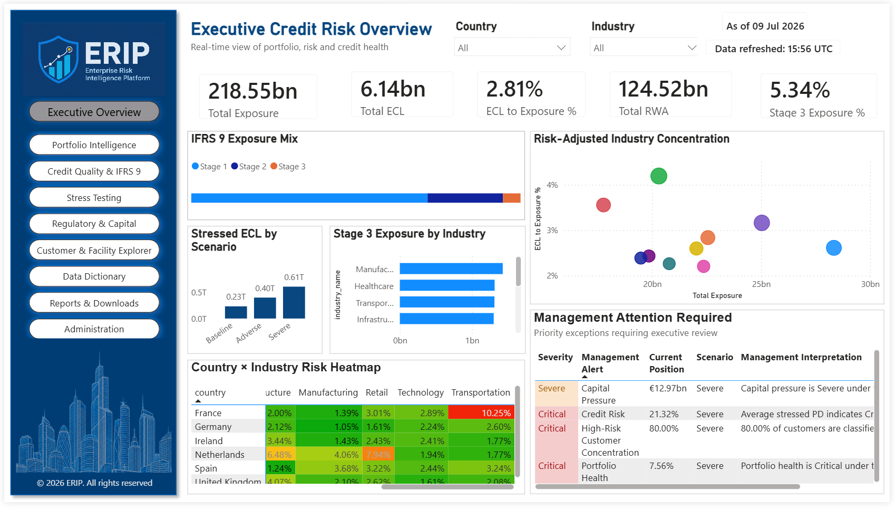
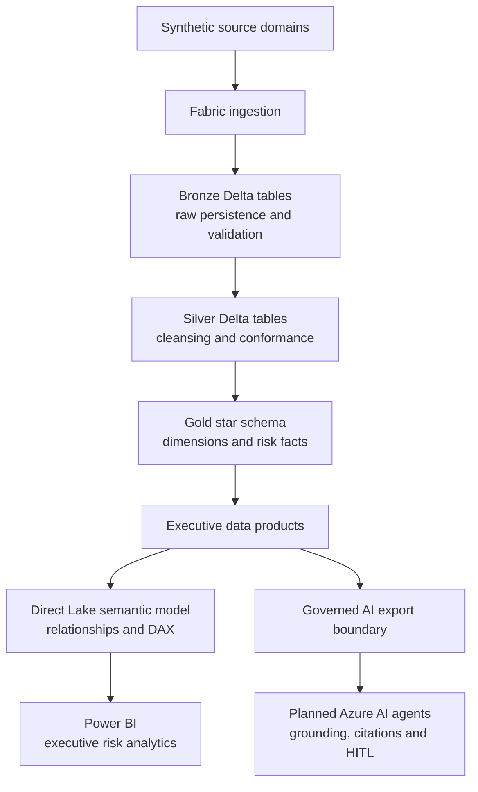
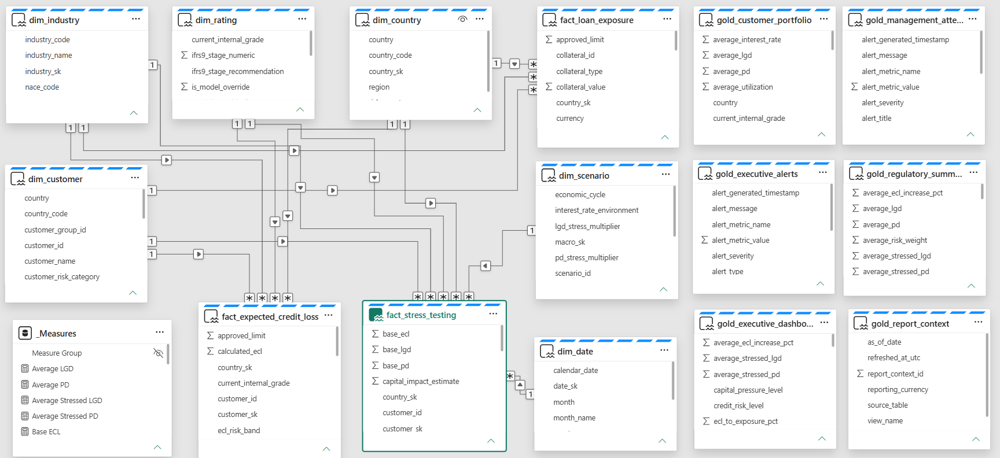

# ERIP — Enterprise Risk Intelligence Platform

> **Enterprise credit-risk data platform and executive decision-intelligence solution**  
> Microsoft Fabric · OneLake · PySpark · Delta Lake · Direct Lake · Power BI · Governed AI architecture

ERIP demonstrates how a financial institution can convert fragmented wholesale credit-risk data into controlled, traceable and decision-ready information products. The V1 implementation spans source ingestion, three-layer data-quality validation, medallion transformation, dimensional modelling, IFRS 9 and Basel-oriented analytics, scenario stress testing, a governed Fabric semantic model and an executive Power BI experience.

The platform uses **synthetic banking data**. It demonstrates architecture and analytical controls; it is not a production regulatory reporting system or a claim of regulatory certification.

## Executive view



The Executive Credit Risk Overview is designed for Chief Risk Officer and portfolio-leadership workflows. It brings exposure, impairment, capital intensity, concentration and management exceptions into one governed view.

The V1 synthetic portfolio snapshot shows:

| Indicator | Value | Decision context |
|---|---:|---|
| Total Exposure | €218.55bn | Portfolio size and concentration base |
| Expected Credit Loss | €6.14bn | Scenario-weighted impairment indicator |
| ECL / Exposure | 2.81% | Relative credit-loss intensity |
| Risk-Weighted Assets | €124.52bn | Capital-intensity indicator |
| Stage 3 Exposure | 5.34% | Credit-impaired portfolio share |

The page combines IFRS 9 exposure mix, stressed ECL scenarios, Stage 3 industry exposure, risk-adjusted concentration, country–industry heatmaps and prioritised management alerts.

## Delivery status

| Capability | V1 status | Evidence |
|---|---|---|
| Source data contracts | Complete | Customer, facility, rating and macroeconomic schemas |
| Bronze ingestion and validation | Complete | Four ingestion notebooks with layered controls |
| Silver conformance | Complete | Customer, Customer 360, loan, rating and macro dimensions |
| Gold analytical core | Complete | Six dimensions and three risk facts |
| Gold executive data products | Complete | Portfolio, regulatory, executive, alert and report-context products |
| Direct Lake semantic model | Complete | Star-schema relationships and central measures |
| Executive Credit Risk Overview | V1 complete | Power BI implementation and screenshot |
| Portfolio Intelligence | In progress | Next analytical dashboard |
| Remaining report suite | Page shells established | Navigation and visual design system in place |
| Multi-agent architecture and governance | Design complete | Architecture and control documents |
| Azure AI agent runtime | Planned extension | Not represented as deployed in V1 |
| Real-time streaming | Future extension | Outside the secured V1 scope |

## Architecture



### Architectural principles

- **Layered accountability:** raw ingestion, business conformance, analytical facts and presentation logic remain separated.
- **Data-product orientation:** Gold outputs have an explicit business purpose, defined consumers and stable analytical meaning.
- **Reproducibility:** notebooks are retained as executable implementation artifacts rather than relying on generated outputs alone.
- **Traceability:** source attributes, rating versions, override reasons, scenario identifiers and reporting context remain available for interpretation.
- **Semantic consistency:** executive measures are centralised in the semantic model rather than reimplemented independently by each visual.
- **Human authority:** AI components are decision-support mechanisms and cannot replace authorised risk or capital decisions.
- **Public-repository hygiene:** PBIX binaries, generated datasets, credentials and environment identifiers are excluded from GitHub.

## Business and regulatory scope

ERIP models the analytical chain used in wholesale credit-risk monitoring:

```text
Counterparty and facility exposure
        → Internal rating and scenario assumptions
        → PD, LGD and EAD risk parameters
        → Expected Credit Loss and stress impacts
        → RWA and capital-intensity indicators
        → Concentration and management exceptions
        → Executive decision support
```

### IFRS 9 analytical coverage

- Stage 1, Stage 2 and Stage 3 exposure segmentation
- Probability of Default, Loss Given Default and Exposure at Default
- Expected Credit Loss calculation and portfolio aggregation
- Baseline, Adverse and Severe scenario analysis
- Stage 3 exposure and concentration indicators
- ECL-to-exposure and stressed-ECL management measures

At a simplified analytical level:

**ECL = PD × LGD × EAD**

Production IFRS 9 implementations require institution-specific lifetime horizons, discounting, cure/default policy, forward-looking scenario weighting, model governance and controlled finance sign-off. Those enterprise controls are represented conceptually but are not claimed as production-certified functionality.

### Basel-oriented risk coverage

- Risk-Weighted Assets and RWA density
- Capital-pressure and capital-impact indicators
- Internal rating grades and rating-model versions
- Rating overrides with required rationale
- Counterparty, country and industry concentration
- Severe-scenario PD/LGD deterioration
- Executive exceptions requiring management review

The project uses Basel concepts for risk intelligence and portfolio monitoring; it does not produce an official regulatory capital return.

## Source domains and data contracts

| Source domain | Representative business content |
|---|---|
| Customer Master | Legal entity, parent hierarchy, LEI, NACE, industry, ESG, KYC and relationship dates |
| Loan Origination | Facility, approved limit, EAD, collateral, repayment, status, currency, RWA and IFRS 9 stage |
| Internal Rating | Grade, PD/LGD, scorecard, history, override, model version and probability band |
| Macroeconomic Scenarios | Baseline, Adverse and Severe assumptions and stress multipliers |

Data contracts establish required columns, data types, valid domains and regulatory expectations before data is promoted through the platform.

## Data-quality and control framework

Bronze ingestion implements three persisted validation layers:

| Control layer | Examples | Purpose |
|---|---|---|
| Schema controls | Required columns, expected types and structural checks | Prevent malformed inputs from entering governed processing |
| Business controls | Non-null keys, positive exposure/collateral, valid status and currency values | Protect analytical integrity |
| Regulatory controls | Valid IFRS 9 stages, PD/LGD bounds, RWA for active facilities, override rationale | Protect risk interpretation and auditability |

Additional governance attributes include legal-entity identifiers, source and reporting periods, model versions, override indicators, scenario identifiers and refresh context.

## Medallion implementation

### Bronze — raw persistence and validation

- Customer Master ingestion
- Loan Origination ingestion
- Internal Rating ingestion
- Macroeconomic Scenario ingestion
- Schema, business and regulatory control results

### Silver — standardised and conformed data

- SCD Type 2 customer dimension processing
- Customer 360 enrichment
- Loan, status, stage and currency standardisation
- Rating, scorecard, override and model-version conformance
- Baseline, Adverse and Severe scenario preparation

### Gold — governed analytical model

**Dimensions:** Customer, Country, Industry, Rating, Scenario and Date.

**Facts:** Loan Exposure, Expected Credit Loss and Stress Testing.

**Executive data products:** Customer Portfolio, Regulatory Summary, Executive Dashboard, Executive Alerts, Management Attention and Reporting Context.

## Semantic model



The Fabric semantic model provides the governed contract between physical Gold tables and executive consumption. It combines conformed dimensions, exposure and impairment facts, scenario results, executive products and a central measure group.

Key design characteristics:

- Star-oriented relationships with shared conformed dimensions
- One-to-many filtering from dimensions to risk facts
- Central measures for exposure, ECL, RWA, PD/LGD and stress indicators
- Country, industry, customer, rating, scenario and date analysis paths
- Dedicated report context for as-of date, refresh time, role and reporting currency
- Direct Lake connectivity for low-latency analytical access to Fabric data

## Executive information architecture

The Power BI design uses a consistent page shell, executive hierarchy, controlled colour semantics, navigation, governed slicers and drill-oriented analysis.

| Report page | Primary decision purpose | Status |
|---|---|---|
| Executive Credit Risk Overview | Portfolio health, impairment, capital pressure and exceptions | V1 complete |
| Portfolio Intelligence | Composition, concentration and counterparty exposure | In progress |
| Credit Quality & IFRS 9 | Stage mix, deterioration and impairment | Planned |
| Stress Testing & Scenario Analysis | Scenario impact on ECL and capital | Planned |
| Regulatory & Capital | RWA, capital intensity and regulatory indicators | Planned |
| Customer & Facility Explorer | Counterparty and facility drill-through | Planned |
| Data Dictionary | Governed definitions and ownership | Planned |
| Reports & Downloads | Controlled report catalogue | Planned |
| Administration | Refresh, quality and platform monitoring | Planned |

## AI-ready control boundary

ERIP includes the technical and governance foundation for a future multi-agent layer without presenting that runtime as already deployed.

Designed specialist roles include CRO, CFO, Portfolio Manager and Risk Analyst agents. The target control model requires:

- Retrieval only from approved Gold products and governed reference content
- Source citations and traceability for material analytical statements
- Role-aware access and classification controls
- Explicit uncertainty and evidence handling
- Human-in-the-loop approval for consequential recommendations
- Separation between analytical assistance and authorised decision rights
- Evaluation datasets for grounding, citation and access-control testing

The current repository includes a Gold-to-AI export notebook, multi-agent architecture and stress/governance context. Azure AI Foundry deployment remains a planned extension.

## Operational sequence

1. Load synthetic source files into the Fabric Lakehouse.
2. Run the four Bronze ingestion and validation notebooks.
3. Build Silver customer, loan, rating and macroeconomic structures.
4. Build Gold dimensions.
5. Build exposure, ECL and stress-testing facts.
6. Build executive Gold data products and reporting context.
7. Refresh the Direct Lake semantic model and validate relationships/measures.
8. Validate Power BI pages, filters, navigation and exception logic.
9. Optionally publish approved Gold outputs across the governed AI boundary.

## Repository navigation

| Area | Contents |
|---|---|
| [`architecture/`](architecture/) | Multi-agent and solution architecture |
| [`docs/governance/`](docs/governance/) | Risk interpretation and AI governance controls |
| [`notebooks/01_bronze/`](notebooks/01_bronze/) | Ingestion and validation notebooks |
| [`notebooks/02_silver/`](notebooks/02_silver/) | Cleansing, conformance and dimensional preparation |
| [`notebooks/03_gold/`](notebooks/03_gold/) | Dimensions, risk facts and executive data products |
| [`notebooks/04_ai/`](notebooks/04_ai/) | AI-facing export notebooks |
| [`powerbi/screenshots/`](powerbi/screenshots/) | Report evidence |
| [`powerbi/semantic_model/`](powerbi/semantic_model/) | Semantic-model evidence |
| [`powerbi/dax/`](powerbi/dax/) | Measure definitions and calculation notes |
| [`images/`](images/) | Reusable report assets |

## Technology stack

- Microsoft Fabric, OneLake and Fabric Lakehouse
- Apache Spark, PySpark and Spark SQL
- Delta Lake / Delta tables
- Medallion architecture and dimensional modelling
- Direct Lake semantic model
- DAX and Power BI
- Azure AI Foundry target architecture
- Git and GitHub

## Evidence and repository policy

The public repository contains reproducible notebooks, architectural decisions, governance documentation and visual evidence. It intentionally excludes PBIX/PBIT binaries, raw or generated datasets, Delta/Parquet outputs, tenant/subscription/capacity identifiers, credentials, secrets and local environment files.

This separation keeps the portfolio reviewable while preserving private recovery material outside the public repository.

---

© 2026 Angeline Paul. All rights reserved.
